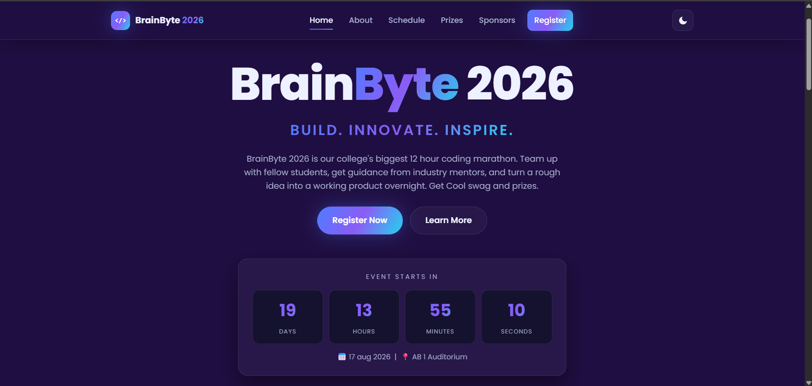
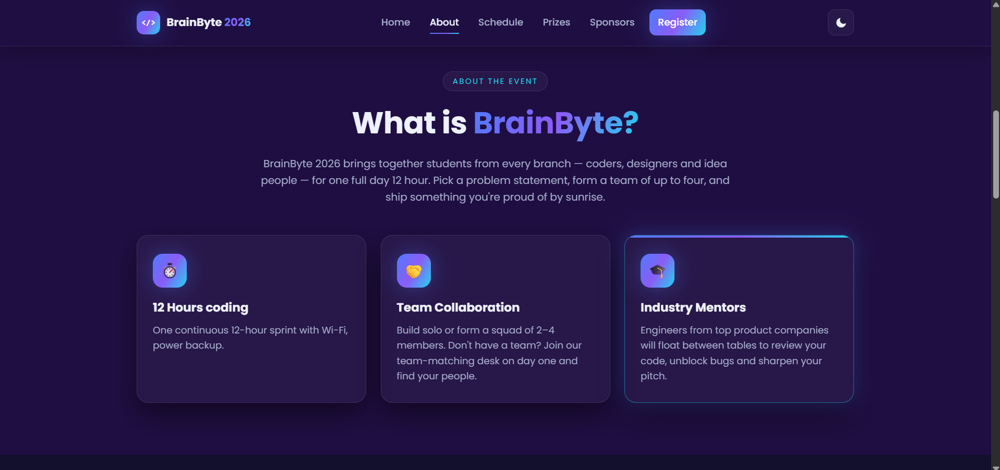
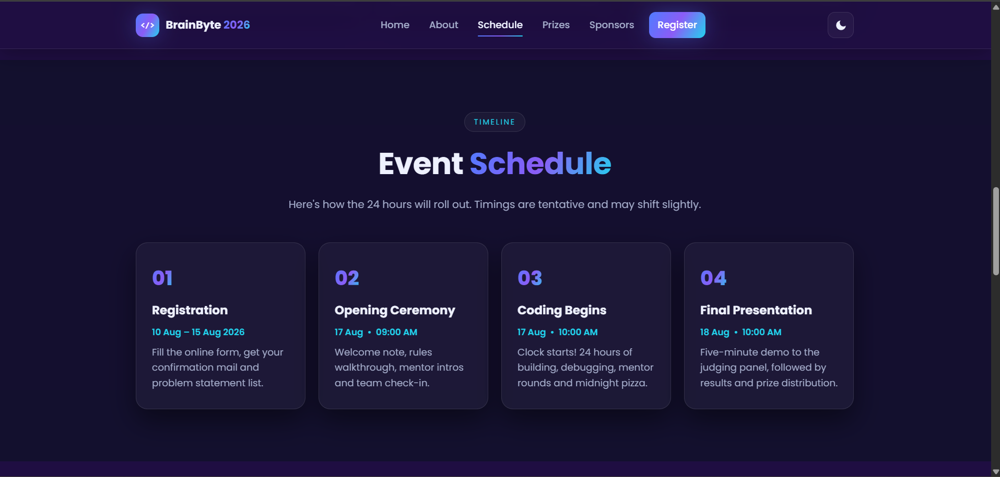
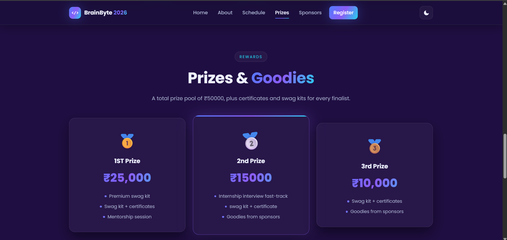
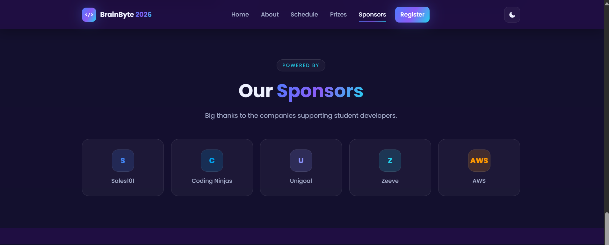
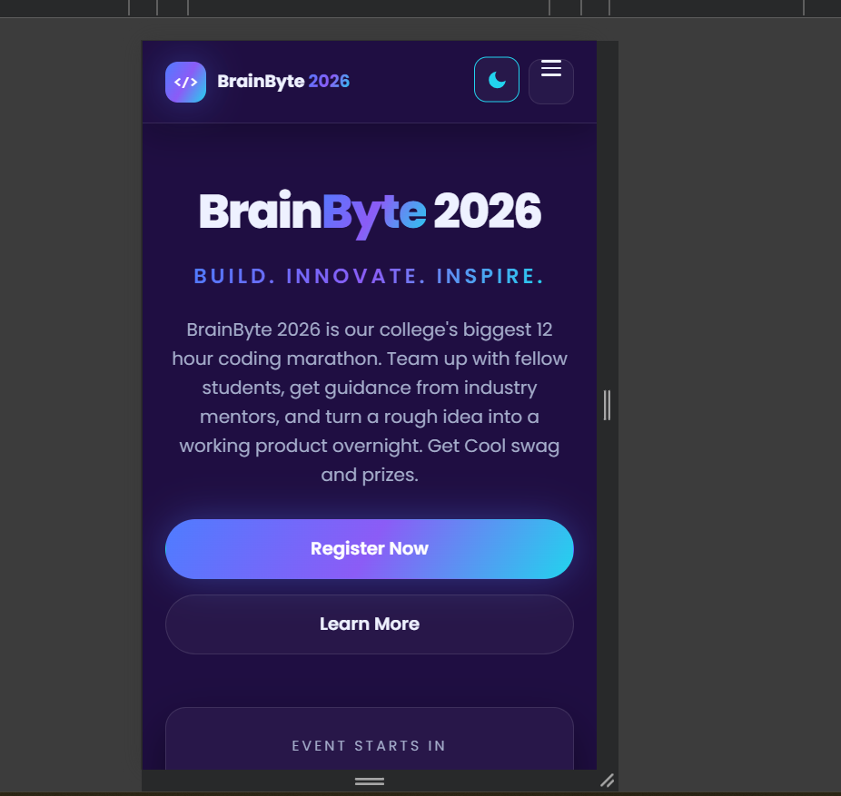

# BrainByte-hackathon-registration-website
BrainByte 2026 is a modern, responsive hackathon registration website built using HTML, CSS, and JavaScript. It features a sleek UI, countdown timer, event schedule, prize section, sponsor showcase, dark/light mode, smooth animations, and seamless Google Forms integration for participant registration.
<b>

# BrainByte 2026

BrainByte 2026 is a modern, responsive hackathon registration website built using HTML, CSS, and JavaScript. It provides participants with complete event information, including the event schedule, prizes, sponsors, countdown timer, and an easy registration process through Google Forms.

The website focuses on providing an engaging user experience with interactive animations, responsive layouts, and a clean user interface.

---

## Implemented Features

### Home Section
- Attractive hero section with event title and tagline
- Call-to-action "Register Now" button
- Live countdown timer showing time remaining until the event
- Event date and venue information

###  About Section
- Brief introduction to BrainByte 2026
- Highlights of the hackathon experience
- Information about:
  - 12-hour coding challenge
  - Team collaboration
  - Industry mentorship

###  Event Schedule
- Complete hackathon timeline
- Registration dates
- Opening ceremony
- Coding session
- Final presentation schedule

###  Prize Section
- Prize pool information
- 1st, 2nd, and 3rd prize details
- Winner benefits and goodies

###  Sponsors Section
- Sponsor showcase
- Company logos and names displayed in responsive cards

###  Registration
- Register button in the navigation bar
- Register Now button on the homepage
- Both buttons redirect users to the official Google Registration Form

###  Dark / Light Mode
- One-click theme switching
- User preference is saved using Local Storage
- Theme remains the same after page refresh

###  Responsive Design
- Fully responsive layout
- Optimized for:
  - Desktop
  - Laptop
  - Tablet
  - Mobile devices

### Interactive UI
- Animated preloader
- Floating programming symbols in the background
- Gradient buttons and text
- Hover animations on cards
- Smooth scrolling navigation
- Scroll reveal animations
- Sticky navigation bar
- Mobile hamburger menu

### Countdown Timer
- Live countdown to the hackathon
- Automatically updates every second

###  Navigation
- Sticky navigation bar
- Active section highlighting while scrolling
- Smooth scrolling between sections
- Mobile navigation menu

###  Performance Features
- CSS variables for easy theme customization
- Local Storage support for theme persistence
- Intersection Observer for efficient scroll animations
- Lightweight implementation using only HTML, CSS, and JavaScript

---

##  Technologies Used

- HTML5
- CSS3
- JavaScript (ES6)
- Google Fonts
- Google Forms
- Vercel

---

##  Project Structure

```
BrainByte/
│── index.html
│── style.css
│── script.js
│── README.md
```

---

##  How to Run the Project

### Method 1

1. Download or clone the repository.


2. Open the project folder.

3. Open `index.html` in your preferred web browser.

### Method 2 (Recommended)

1. Open the project in Visual Studio Code.
2. Install the **Live Server** extension.
3. Right-click `index.html`.
4. Select **Open with Live Server**.

---

##  Deployment

This project is deployed using **Vercel**.

link : https://brainbyte26.vercel.app/

To deploy your own copy:

1. Push the project to GitHub.
2. Import the repository into Vercel.
3. Click **Deploy**.
4. Vercel will automatically generate a live website URL.

---

##  Screenshots

### Home Page


---

### About Section


---

### Schedule Section


---

### Prize Section


---

### Sponsors Section


---


### Mobile View


---

##  Future Enhancements

- User authentication
- Admin dashboard
- Database integration
- Email confirmation after registration
- Live participant counter
- Certificate generation
- Team management system
- FAQ section
- Contact form
- Real sponsor logos
- Event gallery

---

##  Author
Raushan kumar 

www.linkedin.com/in/raushan-singh-711512383
 


## Support

If you found this project useful, consider giving it a ⭐ on GitHub.
